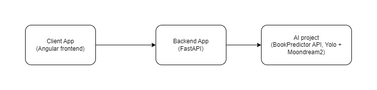
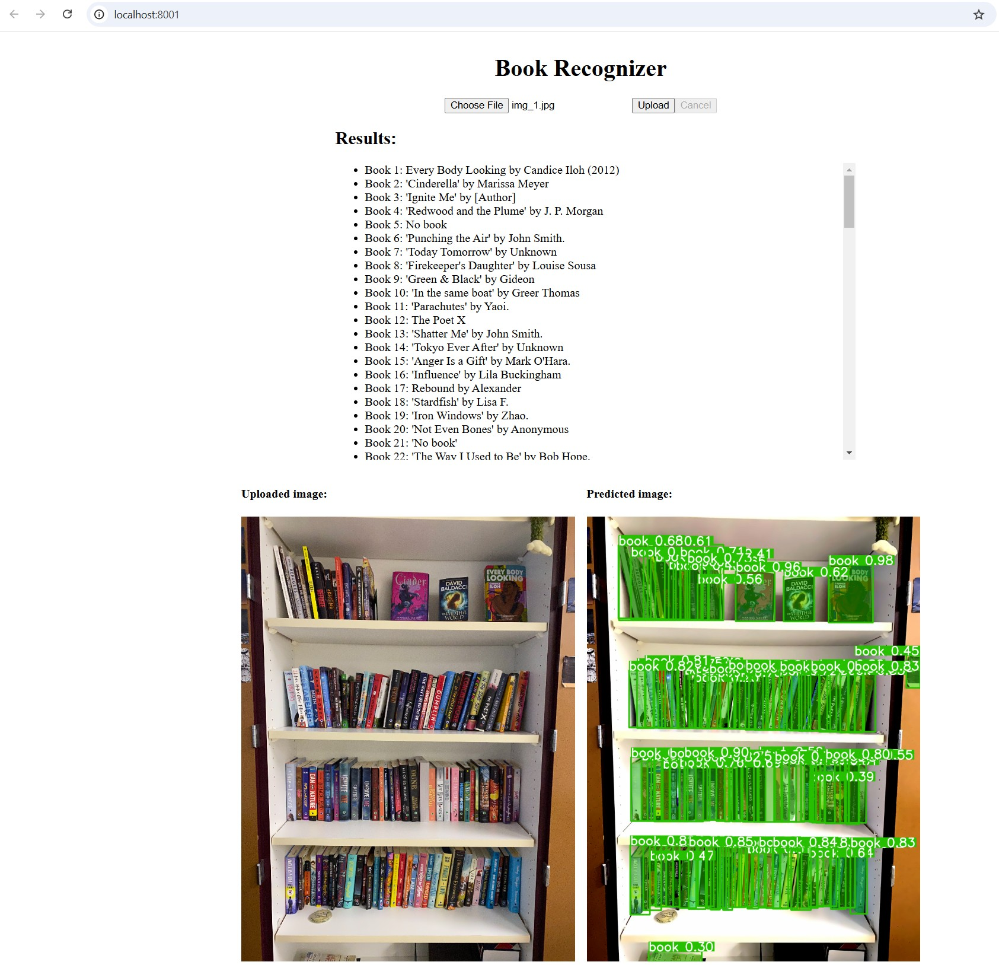

# Bookshelf Scanner App

The Bookshelf Scanner App is an end-to-end solution for detecting books from an image of a bookshelf and identifying their titles and authors. It leverages cutting-edge computer vision (YOLO segmentation) and Large Language Models (Moondream2) to deliver a seamless user experience via a modern web interface.

## Overview

This repository contains three main components:

1. **AI (Python, Poetry):**  
   - **Purpose:** Performs book segmentation from the bookshelf image using a YOLO model. Each detected book spine is then cropped and, if necessary, rotated for correct orientation.
   - **LLM Inference (Moondream2):** After segmentation, the AI model uses a Moondream2 LLM to extract the book title and author from each cropped book image. The Moondream2 model is fine-tuned and quantized for fast inference time.

2. **Backend (Python, FastAPI, Poetry):**  
   - **Purpose:** Provides an HTTP API (`POST /api/predict`) that accepts an uploaded image file and streams the prediction results. The first response chunk includes the segmented image in a suitable format (base64), followed by incremental streams of recognized book titles and authors.
   - **Features:**  
     - Asynchronous API for efficient streaming of inference results.
     - FastAPI-based implementation for scalability and ease of deployment.

3. **Frontend (Angular, Bun):**  
   - **Purpose:** Offers a simple UI where users can upload an image of a bookshelf.
   - **Features:**  
     - Displays the segmented image returned by the backend.
     - Dynamically shows the recognized books’ titles and authors as they stream from the backend.
   - **Tech Stack:** Angular for the SPA, Bun as the runtime and package manager for better performance.

## Workflow

- The user uploads an image via the **Frontend**.
- The **Backend** receives the image and sends it to the **AI** service.
- The **AI** processes the image:
  - Segments the bookshelf image using YOLO.
  - Extracts each book spine.
  - Uses the Moondream2 LLM model to recognize the title and author from each spine.
- The **Backend** streams these results back to the **Frontend**, starting with the segmented image, followed by the books’ data.
- The **Frontend** updates the UI in real-time as the stream arrives.



### Pipeline of image processing and recognition

1. **Image Upload:** The user uploads an image of a bookshelf.
2. **Segmentation:** The image is sent to the AI service, which segments the books from the background using YOLO 11x segmentation model.
3. **Book Extraction:** Each segmented book spine is cropped and rotated if necessary.
4. **Recognition:** Each cropped book individual image is sent to the Moondream2 LLM model for title and author recognition.
5. **Streaming:** The backend streams the segmented image and recognized book titles and authors back to the frontend. The first chunk contains the segmented image, followed by incremental streams of book data as they are recognized in the fomat of `Book {index}: {title} by {author}`.
6. **Display:** The frontend displays the segmented image and dynamically updates the recognized book titles and authors as they arrive.

## Installation

### Prerequisites

You need the following software installed to run the project:

- [Bun](https://bun.sh/docs/installation)
- [Python 3.12](https://www.python.org/downloads)
- [Poetry](https://python-poetry.org/docs)
- [CUDA Toolkit 12.4 or higher](https://developer.nvidia.com/cuda-toolkit-archive)

### Clone the Repository

```bash
git clone https://github.com/suxrobGM/bookshelf-scanner.git
cd bookshelf-scanner
```

## Setup Instructions

### Backend Project

1. **Navigate to the backend directory:**

   ```bash
   cd ./backend
   ```

2. **Install Python dependencies with Poetry:**

    If you haven't installed Poetry yet, you can do so by following the instructions [here](https://python-poetry.org/docs/). Optionally, you can configure Poetry to create virtual environments within the project directory. This is recommended for better project isolation.
    Run the following command:

    ```shell
    poetry config virtualenvs.in-project true
    ```

    Then, install the dependencies:

    ```bash
    poetry install
    ```

3. **Run the Backend API:**

   ```bash
   poetry run fastapi dev src/main.py
   ```

   The API should now be accessible at `http://localhost:8000/docs`.

### Frontend Project

1. **Navigate to the frontend directory:**

   ```bash
   cd ./frontend
   ```

2. **Install Dependencies:**

   ```bash
   bun install
   ```

3. **Run the Frontend Dev Server:**

   ```bash
   bun run start
   ```

   The UI should now be accessible at `http://localhost:8001`

## Usage

1. Open the Frontend in your browser.
2. Upload an image of your bookshelf.
3. Wait for the segmented image to appear, followed by streaming book titles and authors as they’re recognized.

## Screenshots



## Contact

If you have any questions or suggestions, feel free to reach out to me at my email address: <suxrobgm@gmail.com>
My LinkedIn profile: [SuxrobGM](https://www.linkedin.com/in/suxrobgm/)
